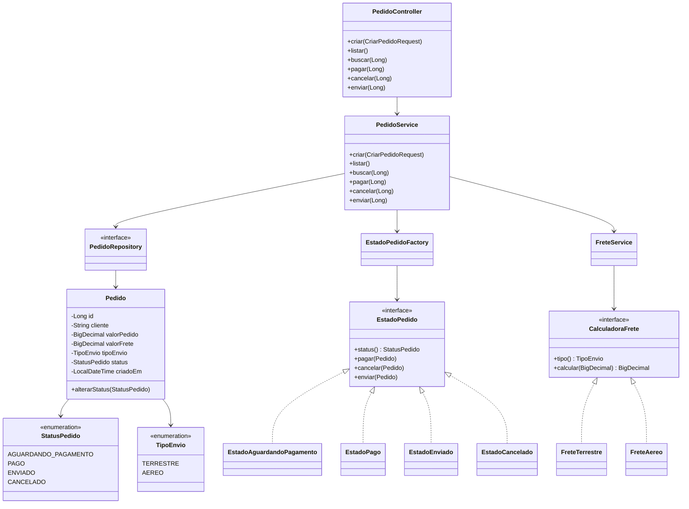

# Atividade - Sistema de Pedidos E-commerce

## Objetivo

O sistema controla pedidos de um e-commerce, permitindo criar pedidos, calcular frete, persistir os dados no banco e alterar o status do pedido de acordo com as regras de negocio.

O projeto foi desenvolvido em Java com Spring Boot, Spring Data JPA e banco H2 em memoria.

## Regras de status do pedido

Quando um pedido e criado, ele inicia com o status `AGUARDANDO_PAGAMENTO`.

Fluxo implementado:

- `AGUARDANDO_PAGAMENTO`: pode ser pago ou cancelado.
- `PAGO`: pode ser enviado ou cancelado, mas nao pode ser pago novamente.
- `ENVIADO`: nao pode mudar de status.
- `CANCELADO`: nao pode mudar de status.

Observacao: o enunciado possui uma contradicao sobre cancelamento depois do pagamento. Em uma parte diz que o pedido pago pode ser cancelado, e em outra diz que uma vez pago nao pode mais ser cancelado. Nesta solucao foi considerada a regra de que o pedido pago pode ser cancelado antes do envio.

## Classe principal do dominio

A classe `Pedido` representa o pedido realizado no e-commerce.

Principais atributos:

- `id`: identificador do pedido.
- `cliente`: nome do cliente.
- `valorPedido`: valor total dos produtos.
- `valorFrete`: valor calculado do frete.
- `tipoEnvio`: tipo de envio escolhido.
- `status`: status atual do pedido.
- `criadoEm`: data e hora da criacao.

## Diagrama de classes

A imagem do diagrama tambem esta disponivel em:

`docs/diagrama-classes.svg`



## Diagrama de estados do pedido

A imagem do diagrama de estados esta disponivel em:

`docs/diagrama-status.svg`

Esse diagrama mostra as transicoes permitidas:

- Pedido criado inicia em `AGUARDANDO_PAGAMENTO`.
- De `AGUARDANDO_PAGAMENTO`, pode ir para `PAGO` ou `CANCELADO`.
- De `PAGO`, pode ir para `ENVIADO` ou `CANCELADO`.
- `ENVIADO` e `CANCELADO` sao estados finais.

## Diagrama de arquitetura

A imagem do diagrama de arquitetura esta disponivel em:

`docs/diagrama-arquitetura.svg`

Esse diagrama mostra a separacao em camadas:

- `Postman`: cliente usado para testar a API.
- `PedidoController`: recebe as requisicoes HTTP.
- `PedidoService`: executa as regras de negocio.
- `State Pattern`: controla as transicoes de status.
- `Strategy Pattern`: calcula o frete.
- `PedidoRepository`: realiza a persistencia via Spring Data JPA.
- `H2`: banco de dados usado nos testes.

## Diagrama de sequencia

A imagem do diagrama de sequencia esta disponivel em:

`docs/diagrama-sequencia-criar-pedido.svg`

Esse diagrama mostra o fluxo para criar um pedido:

1. O Postman envia `POST /pedidos`.
2. O `PedidoController` recebe o JSON.
3. O `PedidoService` executa a regra de criacao.
4. O `FreteService` calcula o frete conforme o tipo de envio.
5. O `PedidoRepository` salva o pedido no banco.
6. A API retorna `201 Created` com os dados do pedido.

## Padroes de projeto utilizados

### State

O padrao State foi utilizado para controlar as mudancas de status do pedido.

Cada status possui uma classe propria que sabe quais operacoes sao permitidas naquele momento:

- `EstadoAguardandoPagamento`
- `EstadoPago`
- `EstadoEnviado`
- `EstadoCancelado`

Esse padrao foi escolhido porque as regras de transicao mudam conforme o status atual do pedido. Assim, evita-se colocar varios `if`/`else` dentro do service, deixando o codigo mais organizado e facil de manter.

Exemplo: se o pedido esta `CANCELADO`, qualquer tentativa de pagar, enviar ou cancelar novamente gera erro, pois esse estado nao permite novas transicoes.

### Strategy

O padrao Strategy foi utilizado para calcular o valor do frete.

Cada tipo de envio possui uma estrategia de calculo:

- `FreteTerrestre`: calcula 5% do valor do pedido.
- `FreteAereo`: calcula 10% do valor do pedido.

Esse padrao foi escolhido porque o enunciado informa que novas formas de envio poderao ser adicionadas no futuro. Com Strategy, basta criar uma nova classe implementando `CalculadoraFrete`, sem alterar a regra das classes ja existentes.

## Persistencia no banco de dados

O sistema usa Spring Data JPA para persistir os pedidos.

A interface `PedidoRepository` estende `JpaRepository`, fornecendo automaticamente operacoes como salvar, listar, buscar por ID e atualizar.

O banco configurado para testes e o H2 em memoria:

- URL do console: `http://localhost:8080/h2-console`
- JDBC URL: `jdbc:h2:mem:pedidosdb`
- Usuario: `sa`
- Senha: vazia

## APIs REST

Base URL:

```text
http://localhost:8080
```

### Criar pedido

```http
POST /pedidos
```

Body:

```json
{
  "cliente": "Maria Silva",
  "valorPedido": 200.00,
  "tipoEnvio": "TERRESTRE"
}
```

Resposta esperada:

```json
{
  "id": 1,
  "cliente": "Maria Silva",
  "valorPedido": 200.00,
  "valorFrete": 10.00,
  "tipoEnvio": "TERRESTRE",
  "status": "AGUARDANDO_PAGAMENTO",
  "criadoEm": "2026-05-31T20:00:00"
}
```

### Criar pedido com envio aereo

```http
POST /pedidos
```

Body:

```json
{
  "cliente": "Joao Santos",
  "valorPedido": 300.00,
  "tipoEnvio": "AEREO"
}
```

Nesse caso, o frete sera 10% do valor do pedido.

### Listar pedidos

```http
GET /pedidos
```

### Buscar pedido por ID

```http
GET /pedidos/{id}
```

Exemplo:

```http
GET /pedidos/1
```

### Pagar pedido

```http
POST /pedidos/{id}/pagar
```

Exemplo:

```http
POST /pedidos/1/pagar
```

### Cancelar pedido

```http
POST /pedidos/{id}/cancelar
```

Exemplo:

```http
POST /pedidos/1/cancelar
```

### Enviar pedido

```http
POST /pedidos/{id}/enviar
```

Exemplo:

```http
POST /pedidos/1/enviar
```

## Como testar no Postman

1. Execute a aplicacao Spring Boot.
2. Crie um pedido com `POST /pedidos`.
3. Copie o `id` retornado.
4. Use o `id` para testar `pagar`, `cancelar` e `enviar`.

Fluxo recomendado:

```text
POST /pedidos
POST /pedidos/1/pagar
POST /pedidos/1/enviar
GET /pedidos/1
```

Fluxo de cancelamento:

```text
POST /pedidos
POST /pedidos/2/cancelar
POST /pedidos/2/pagar
```

O ultimo request deve retornar erro, pois pedido cancelado nao pode mudar de status.

## Como executar

Pelo terminal, dentro da pasta do projeto:

```bash
mvn spring-boot:run
```

Para rodar os testes:

```bash
mvn test
```
