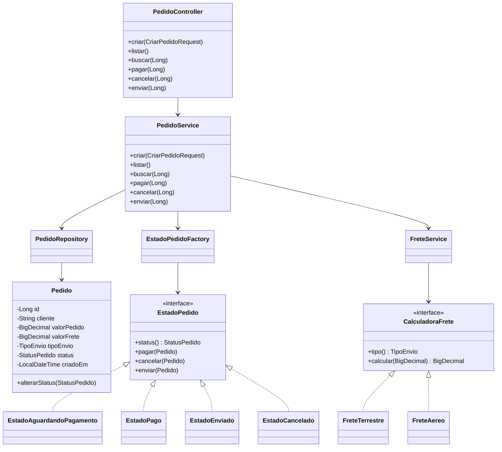

# Solucao proposta - E-commerce de pedidos

## Diagrama de classes



## Padroes de projeto utilizados

### State

O padrao State foi usado para controlar as regras de mudanca de status do pedido.
Cada status possui uma classe propria:

- `EstadoAguardandoPagamento`: permite pagar ou cancelar.
- `EstadoPago`: permite enviar ou cancelar, mas nao permite pagar novamente.
- `EstadoEnviado`: nao permite novas mudancas.
- `EstadoCancelado`: nao permite novas mudancas.

Isso evita espalhar muitos `if`/`else` pelo sistema e deixa as regras de cada estado concentradas em uma classe.

### Strategy

O padrao Strategy foi usado para calcular o frete.
Cada forma de envio possui sua propria estrategia:

- `FreteTerrestre`: 5% do valor do pedido.
- `FreteAereo`: 10% do valor do pedido.

Para adicionar uma nova forma de envio, basta criar uma nova classe que implemente `CalculadoraFrete` e adicionar o novo valor no enum `TipoEnvio`.

## Endpoints para Postman

Base URL: `http://localhost:8080`

### Criar pedido

`POST /pedidos`

```json
{
  "cliente": "Maria",
  "valorPedido": 200.00,
  "tipoEnvio": "TERRESTRE"
}
```

### Listar pedidos

`GET /pedidos`

### Buscar pedido

`GET /pedidos/{id}`

### Pagar pedido

`POST /pedidos/{id}/pagar`

### Cancelar pedido

`POST /pedidos/{id}/cancelar`

### Enviar pedido

`POST /pedidos/{id}/enviar`

## Banco de dados

A aplicacao usa H2 em memoria para facilitar os testes.
O console fica em:

`http://localhost:8080/h2-console`

Dados de conexao:

- JDBC URL: `jdbc:h2:mem:pedidosdb`
- User: `sa`
- Password: vazio
